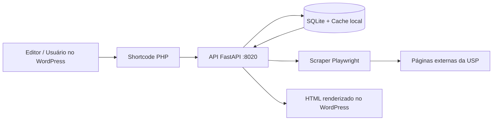
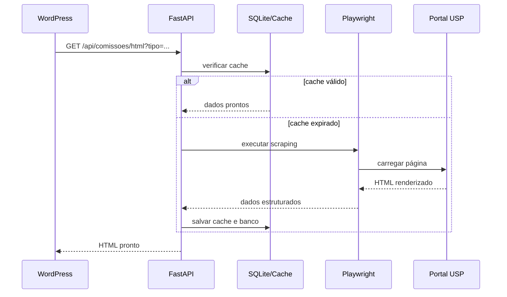
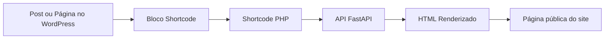
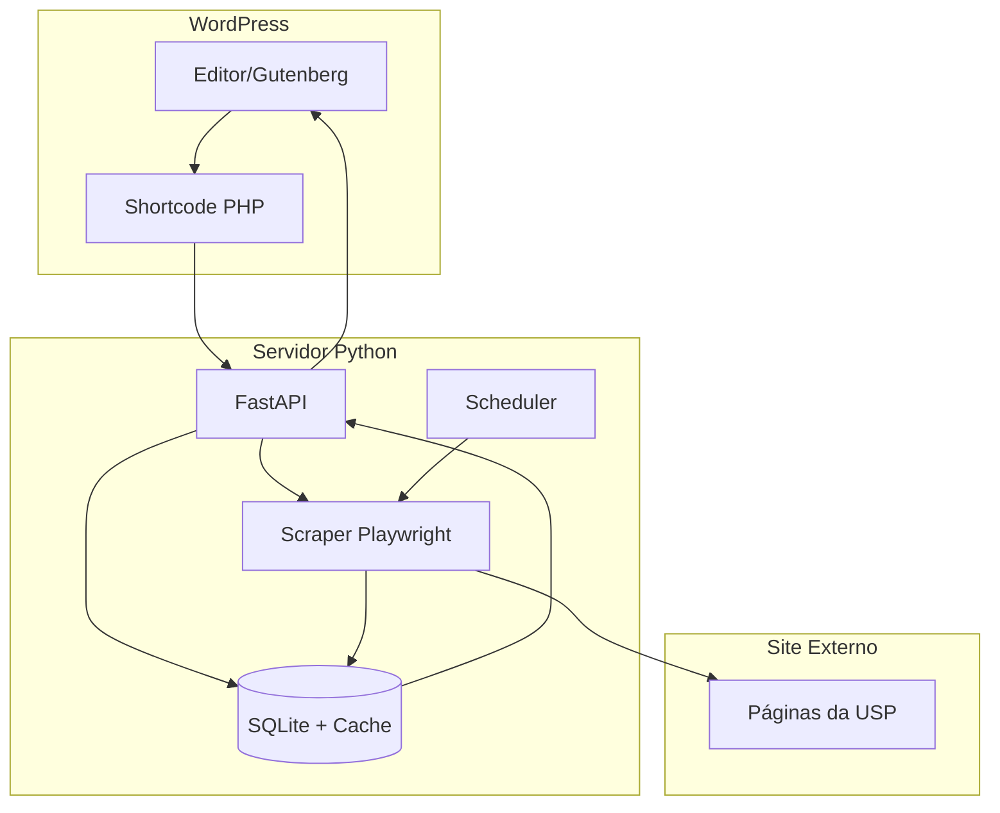

# Sistema de Comissões IME/USP
## Documentação técnica, arquitetura, exemplos visuais e guia de uso do Antigravity

**Versão:** 1.0  
**Última atualização:** 30/06/2026  
**Objetivo:** documentar o sistema para manutenção futura, continuidade por outro programador e apoio em homologação/produção.

---

## Capa sugerida

**Instituição:** IME/USP  
**Projeto:** Sistema de Comissões IME/USP  
**Documento:** Documentação técnica e guia de uso  
**Autor:** equipe técnica  
**Formato:** PDF a partir de Markdown  

> Imagem de capa sugerida: logo institucional do IME/USP em fundo branco ou azul institucional.

---

## Sumário

1. Visão geral  
2. Objetivo do projeto  
3. Arquitetura geral  
4. Estrutura do projeto  
5. Fluxo de funcionamento  
6. Banco de dados  
7. Categorias de comissões  
8. Integração com WordPress  
9. API e endpoints  
10. Scraper e automação  
11. Instalação e deploy  
12. Antigravity: prompts passo a passo  
13. Figuras e imagens sugeridas  
14. Boas práticas e manutenção futura  
15. Conclusão  

---

# 1. Visão geral

Este sistema foi criado para automatizar a coleta, organização e exibição das comissões, colegiados e conselhos do IME/USP. Ele busca os dados em páginas externas da USP, processa essas informações em Python e disponibiliza o conteúdo para exibição no WordPress por meio de shortcode.

## O sistema permite

- Coletar dados de páginas externas da USP.
- Processar páginas dinâmicas carregadas por JavaScript.
- Armazenar dados localmente em SQLite.
- Expor uma API em Python.
- Atualizar os dados automaticamente em horário agendado.
- Atualizar manualmente com um clique.
- Renderizar as informações no WordPress.
- Exibir uma ou mais comissões em blocos separados.
- Organizar a exibição por categoria, lista de IDs ou comissão individual.
- Gerar layout amigável para impressão/PDF.

---

# 2. Objetivo do projeto

O objetivo principal é substituir o trabalho manual de:

- copiar dados de várias páginas externas;
- organizar listas em planilhas;
- colar conteúdo manualmente no WordPress;
- atualizar informações com frequência de forma repetitiva.

Com isso, o sistema passa a concentrar a lógica de coleta, cache, publicação e exibição em um único fluxo técnico.

---

# 3. Arquitetura geral

O projeto foi dividido em três camadas principais:

- **Coleta de dados**
- **Persistência e processamento**
- **Exibição**

## 3.1 Diagrama da arquitetura



## 3.2 Explicação do fluxo

- O WordPress chama o shortcode.
- O shortcode faz a requisição à API.
- A API verifica cache e banco.
- Se necessário, o scraper acessa a página externa da USP.
- Os dados são processados e armazenados.
- O HTML final é devolvido ao WordPress.

---

# 4. Tecnologias usadas

## Backend
- **Python**
- **FastAPI**
- **SQLAlchemy**
- **SQLite**
- **Playwright**
- **Jinja2**
- **APScheduler**

## Infraestrutura
- **Docker**
- **docker-compose**
- Porta exposta: **8020**

## Frontend / Integração
- **WordPress**
- **Gutenberg**
- **Shortcode PHP**
- HTML e CSS próprios com prefixo `ime-`

---

# 5. Estrutura esperada do projeto

O projeto deve ficar em:

```text
/sistemas/comissoes/
```

## Estrutura sugerida

```text
/sistemas/comissoes/
├── docker-compose.yml
├── Dockerfile
├── requirements.txt
├── .env.example
├── .gitignore
├── README.md
├── manual-wordpress.md
├── manual-tecnico.md
├── sistema-comissoes-documentacao.md
├── sistema-comissoes-documentacao-pdf.md
├── app/
│   ├── main.py
│   ├── database.py
│   ├── models.py
│   ├── scraper.py
│   ├── scheduler.py
│   ├── seed.py
│   ├── routes/
│   │   ├── api.py
│   │   └── admin.py
│   └── templates/
│       ├── admin/
│       │   ├── base.html
│       │   ├── login.html
│       │   ├── dashboard.html
│       │   ├── comissao_form.html
│       │   └── comissao_list.html
│       └── public/
│           └── comissao.html
├── wordpress/
│   └── shortcode.php
├── docs/
│   ├── img/
│   └── pdf/
└── data/
    ├── db.sqlite3
    └── cache/
```

---

# 6. Fluxo de funcionamento

## 6.1 Coleta
1. O sistema lê a lista de comissões cadastradas.
2. Para cada comissão, acessa a URL correspondente.
3. Aguarda o carregamento da página dinâmica.
4. Extrai os dados necessários.
5. Salva o resultado no banco e em cache.

## 6.2 Exibição
1. O WordPress chama o shortcode.
2. O shortcode chama a API do Python.
3. A API devolve HTML pronto para renderização.
4. O HTML é inserido na página do WordPress.

## 6.3 Atualização automática
1. O scheduler executa em horário agendado.
2. O scraper percorre as URLs cadastradas.
3. O banco e o cache são atualizados.
4. O site passa a exibir os dados novos.

## 6.4 Diagrama do fluxo de dados



---

# 7. Banco de dados

O banco usado é **SQLite**.

## Tabela principal
A tabela principal deve conter, no mínimo:

- `id`
- `colegiado`
- `link`
- `categoria`
- `ativo`
- `created_at`
- `updated_at`

## Observações

- `categoria` serve para exibir blocos separados no WordPress.
- `ativo` permite desabilitar uma comissão sem apagar o registro.
- O banco e o cache não devem ser versionados no Git.

---

# 8. Categorias de comissões

As categorias servem para organizar a apresentação por blocos.

## Exemplos de categorias
- `orgaos-colegiados`
- `conselhos-departamento`
- `cursos-graduacao`
- `programas-posgraduacao`
- `comissoes-estatutarias`
- `mais-comissoes`

## Uso prático
- Página principal com todas as comissões.
- Seção separada por categoria.
- Página individual de comissão.
- Conjunto de comissões selecionadas manualmente.

---

# 9. Variáveis de ambiente

O sistema usa um arquivo `.env`.

## Exemplo

```env
ADMIN_USER=admin
ADMIN_PASSWORD=senha_forte_aqui
SECRET_KEY=uma_chave_longa_e_aleatoria
TZ=America/Sao_Paulo
AMBIENTE=homologacao
```

## Significado das variáveis

- `ADMIN_USER`: usuário do painel administrativo.
- `ADMIN_PASSWORD`: senha do painel administrativo.
- `SECRET_KEY`: chave para sessões e autenticação.
- `TZ`: fuso horário do servidor.
- `AMBIENTE`: identifica homologação ou produção.

---

# 10. WordPress: integração do shortcode

O WordPress consome o conteúdo da API por meio de shortcode.

## Shortcode principal

```text
[ime_comissoes]
```

## Variações úteis

```text
[ime_comissoes id="14"] (Exibe como plano por padrão)
[ime_comissoes ids="13,14,15"]
[ime_comissoes tipo="conselhos-departamento"]
[ime_comissoes tipo="conselhos-departamento" layout="acordeon-aberto"]
[ime_comissoes id="14" layout="acordeon"] (Força o acordeon fechado para item único)
[ime_comissoes ids="13,14" layout="plano"] (Exibe comissões sem comportamento sanfona)
```

## Observações importantes

- Use sempre aspas normais: `" "`
- Não use aspas curvas: `“ ”`
- O shortcode deve ser inserido no bloco **Shortcode** do Gutenberg
- Se o shortcode aparecer como texto, o snippet ou o plugin não está ativo corretamente

## Diagrama da integração WordPress → API



---

# 11. Página no WordPress: como editar

## Passos gerais

1. Entrar no painel do WordPress.
2. Ir em **Páginas → Todas as páginas**.
3. Abrir a página desejada.
4. Inserir um bloco de **Shortcode**.
5. Colar o shortcode.
6. Atualizar a página.
7. Visualizar o resultado.

## Exemplo de organização por blocos

- Título da seção
- Bloco de shortcode
- Repetir para outra categoria ou conjunto

---

# 12. API

A API é o ponto central de consumo dos dados.

## Endpoints esperados

### JSON
- `GET /api/comissoes`
- `GET /api/comissao/{id}`

### HTML
- `GET /api/comissoes/html`
- `GET /api/comissao/{id}/html`

## Filtros previstos
- `id`
- `ids`
- `tipo`

## Exemplos de uso
- todas as comissões
- uma comissão específica
- lista manual de IDs
- categoria específica

---

# 13. Scraper

O scraper é a parte mais sensível do sistema.

## Responsabilidades
- abrir a página como navegador real;
- aguardar carregamento da SPA;
- extrair conteúdo dinâmico;
- lidar com variações de estrutura;
- salvar cache;
- retornar JSON padronizado.

## Dados esperados
- nome da comissão;
- membros;
- cargos;
- início do mandato;
- fim do mandato;
- seções internas quando existirem.

## Observação
As páginas da USP podem mudar ao longo do tempo. Por isso, o scraper deve ser flexível e tolerante a alterações de estrutura.

---

# 14. Painel administrativo

O sistema pode ter uma área administrativa própria para gestão das comissões.

## Funções esperadas
- login e senha;
- cadastro de comissão;
- edição de URL;
- alteração de categoria;
- ativação/desativação;
- atualização manual;
- reprocessamento completo.

## Requisito de segurança
O acesso administrativo deve ser protegido e não exposto publicamente sem autenticação.

---

# 15. Atualização automática

O sistema pode executar atualizações em horário agendado.

## Recomendações
- executar de madrugada;
- registrar logs;
- usar retry em falhas de rede;
- preservar cache local;
- evitar sobrescrever dados válidos em caso de erro temporário.

---

# 16. Exemplos de imagens e capturas para o PDF

> As imagens abaixo são sugestões para enriquecer a documentação.  
> Você pode salvar os arquivos em `docs/img/` e manter os nomes padronizados.

## Imagens sugeridas

1. `docs/img/01-capa-ime-usp.png`
   - imagem de capa institucional do documento

2. `docs/img/02-wordpress-shortcode.png`
   - captura da página do WordPress com o bloco Shortcode

3. `docs/img/03-pagina-comissoes-expandida.png`
   - captura de uma comissão aberta com membros visíveis

4. `docs/img/04-painel-admin.png`
   - captura do painel administrativo do sistema

5. `docs/img/05-fluxo-scraper.png`
   - diagrama visual do fluxo de scraping

6. `docs/img/06-arquitetura-sistema.png`
   - diagrama geral do sistema

## Exemplo de inclusão no Markdown

```md

```

---

# 17. Exemplo de diagrama visual da arquitetura



---

# 18. Instalação local

## 18.1 Clonar o repositório

```bash
cd /sistemas
git clone https://github.com/luiscarlosdesouza/comissoes.git comissoes
cd /sistemas/comissoes
```

## 18.2 Criar o arquivo `.env`

```bash
cat > .env << 'EOF'
ADMIN_USER=admin
ADMIN_PASSWORD=senha_forte_aqui
SECRET_KEY=uma_chave_longa_e_aleatoria
TZ=America/Sao_Paulo
AMBIENTE=homologacao
EOF
```

## 18.3 Criar as pastas necessárias

```bash
mkdir -p data/cache
```

## 18.4 Build dos containers

```bash
docker compose build
```

## 18.5 Criar o banco e popular os dados iniciais

```bash
docker compose run --rm app python app/database.py
docker compose run --rm app python app/seed.py
```

## 18.6 Subir a aplicação

```bash
docker compose up -d
```

## 18.7 Testar a API

```bash
curl http://localhost:8020/api/comissoes
```

---

# 19. Instalação em servidor de homologação

## 19.1 Acessar o servidor

```bash
ssh usuario@ip-do-servidor
```

## 19.2 Criar a pasta do projeto

```bash
mkdir -p /sistemas/comissoes
cd /sistemas/comissoes
```

## 19.3 Clonar o repositório

```bash
git clone https://github.com/luiscarlosdesouza/comissoes.git .
```

## 19.4 Criar o `.env`

```bash
cat > .env << 'EOF'
ADMIN_USER=admin
ADMIN_PASSWORD=senha_forte_aqui
SECRET_KEY=uma_chave_longa_e_aleatoria
TZ=America/Sao_Paulo
AMBIENTE=homologacao
EOF
```

## 19.5 Criar diretórios

```bash
mkdir -p data/cache
```

## 19.6 Build e inicialização

```bash
docker compose build
docker compose run --rm app python app/database.py
docker compose run --rm app python app/seed.py
docker compose up -d
```

---

# 20. Testes recomendados

## Testes da API
- verificar retorno em `/api/comissoes`;
- testar filtro por categoria;
- testar retorno por ID;
- conferir o HTML gerado.

## Testes do scraper
- executar uma comissão conhecida;
- validar o JSON retornado;
- verificar se o cache foi salvo.

## Testes do WordPress
- inserir shortcode;
- validar renderização;
- testar página com vários blocos;
- verificar PDF/impressão.

---

# 21. Problemas comuns e solução

## 21.1 O shortcode aparece como texto
Verifique:

- se o shortcode está correto;
- se o snippet/plugin está ativo;
- se o bloco usado é o bloco **Shortcode**;
- se as aspas são normais.

## 21.2 A API não responde
Verifique:

- se o container está rodando;
- se a porta **8020** está aberta;
- se a URL do serviço está correta;
- se o deploy foi atualizado.

## 21.3 O scraper falha
Possíveis causas:

- mudança na estrutura da página externa;
- carregamento lento;
- seletor não encontrado;
- instabilidade temporária da página da USP.

## 21.4 O PDF não sai corretamente
Verifique:

- se o CSS de impressão está carregando;
- se o botão de impressão está dentro do bloco correto;
- se o conteúdo não foi quebrado por CSS do tema do WordPress.

---

# 22. Boas práticas de manutenção

- não versionar `.env`;
- não versionar banco SQLite;
- não versionar cache gerado;
- registrar mudanças importantes no README;
- atualizar esta documentação quando houver mudanças no scraper;
- testar primeiro em homologação;
- só depois promover para produção.

---

# 23. Estrutura das comissões e blocos no WordPress

## Exemplo de organização sugerida

### Órgãos colegiados
```text
[ime_comissoes tipo="orgaos-colegiados"]
```

### Conselhos de departamento
```text
[ime_comissoes tipo="conselhos-departamento"]
```

### Graduação
```text
[ime_comissoes tipo="cursos-graduacao"]
```

### Pós-graduação
```text
[ime_comissoes tipo="programas-posgraduacao"]
```

### Outras comissões
```text
[ime_comissoes tipo="mais-comissoes"]
```

### Ordem manual
Se precisar controlar exatamente a ordem:

```text
[ime_comissoes ids="14,7,22"]
```

---

# 24. Estrutura de arquivos importantes

## Backend
- `app/main.py`
- `app/database.py`
- `app/models.py`
- `app/scraper.py`
- `app/scheduler.py`
- `app/seed.py`

## Rotas
- `app/routes/api.py`
- `app/routes/admin.py`

## Templates
- `app/templates/admin/base.html`
- `app/templates/admin/login.html`
- `app/templates/admin/dashboard.html`
- `app/templates/admin/comissao_form.html`
- `app/templates/admin/comissao_list.html`
- `app/templates/public/comissao.html`

## Integração WordPress
- `wordpress/shortcode.php`

---

# 25. Prompt passo a passo para uso no Antigravity

Esta seção documenta a sequência recomendada de prompts para reconstrução ou evolução do sistema.

## 25.1 Etapa 1 — definição do escopo

### Prompt
```text
Preciso desenvolver um sistema em Python para automatizar a exibição de dados de comissões e colegiados da USP dentro de um site WordPress existente.

Contexto:
- O WordPress já existe em produção
- A integração será feita por shortcode PHP
- O sistema vai rodar em Docker na porta 8020
- O projeto ficará em /sistemas/comissoes/

Stack desejada:
- Python
- FastAPI
- Jinja2
- Playwright
- SQLite
- APScheduler
- Docker + docker-compose

Requisitos:
- área administrativa com login e senha
- cadastro de comissões com nome e URL
- scraping das páginas externas da USP, que são SPAs em Vue.js
- atualização automática de madrugada
- botão manual para forçar atualização
- exibição pública em accordion
- botão para salvar em PDF
- shortcode no WordPress para consumir a API
- CSS sem conflito com o tema do WordPress

Quero que o projeto seja gerado de forma organizada, arquivo por arquivo, com boa estrutura de manutenção.
```

### Por que esta etapa existe
- Define claramente o problema.
- Evita que a IA crie arquivos fora do contexto.
- Estabelece a arquitetura antes da implementação.

---

## 25.2 Etapa 2 — arquivos base

### Prompt
```text
Gere agora os arquivos base do projeto:

1. docker-compose.yml
2. Dockerfile
3. requirements.txt
4. .env.example
5. README.md

O projeto deve estar pronto para rodar em /sistemas/comissoes/ e expor a aplicação na porta 8020.
```

### Por que esta etapa existe
- Prepara a execução.
- Evita escrever lógica antes da infraestrutura.
- Facilita deploy local e em servidor.

---

## 25.3 Etapa 3 — banco de dados e seed

### Prompt
```text
Agora gere:

1. app/database.py
2. app/models.py
3. app/seed.py

Use SQLite com SQLAlchemy.

O seed deve criar e popular a tabela com os dados do arquivo CSV de comissões que já foi fornecido, contendo:
- colegiado
- link

Crie os registros iniciais com nome da comissão e URL.
```

### Por que esta etapa existe
- Garante persistência.
- Permite começar com dados reais.
- Evita dependência de inserção manual.

---

## 25.4 Etapa 4 — scraper

### Prompt
```text
Agora gere o arquivo app/scraper.py usando Playwright em Python.

As páginas externas da USP são SPAs em Vue.js, então o scraper precisa:
- abrir a página como um navegador real
- aguardar o conteúdo renderizar
- extrair:
  - título da comissão
  - seções como titulares, suplentes ou grupos equivalentes
  - nome do membro
  - início do mandato
  - fim do mandato

O scraper deve:
- ter retry automático
- salvar cache local
- retornar JSON padronizado
- funcionar de forma flexível, porque cada comissão pode ter estrutura diferente
```

### Por que esta etapa existe
- A parte externa é dinâmica.
- O scraper precisa lidar com variações.
- É a parte mais crítica do sistema.

---

## 25.5 Etapa 5 — API, rotas e agendamento

### Prompt
```text
Agora gere os arquivos:

1. app/routes/api.py
2. app/routes/admin.py
3. app/scheduler.py
4. app/main.py

Requisitos:
- API pública para listar comissões e retornar o conteúdo formatado
- painel administrativo com autenticação por usuário e senha
- botão para atualizar uma comissão manualmente
- botão para atualizar todas
- agendamento automático para rodar de madrugada
- integração com o banco SQLite e o scraper
```

### Por que esta etapa existe
- Cria o ponto de consumo dos dados.
- Automatiza a atualização.
- Forma a base do sistema em produção.

---

## 25.6 Etapa 6 — templates

### Prompt
```text
Agora gere os templates Jinja2:

1. app/templates/admin/base.html
2. app/templates/admin/login.html
3. app/templates/admin/dashboard.html
4. app/templates/admin/comissao_form.html
5. app/templates/admin/comissao_list.html
6. app/templates/public/comissao.html

Requisitos do HTML público:
- layout limpo
- classes prefixadas com ime-
- accordion/dropdown
- botão salvar em PDF
- CSS de impressão para mostrar só o conteúdo da comissão
- sem conflito com o tema do WordPress
```

### Por que esta etapa existe
- Separa administração e exibição.
- Mantém consistência visual.
- Facilita manutenção futura.

---

## 25.7 Etapa 7 — shortcode do WordPress

### Prompt
```text
Agora gere o arquivo wordpress/shortcode.php.

Ele deve criar o shortcode [ime_comissoes] para uso no WordPress.

Requisitos:
- montar um accordion com as comissões
- buscar os dados na API do Python
- carregar o conteúdo no local do shortcode
- manter o layout do WordPress
- ser simples de manter caso o tema seja alterado
```

### Por que esta etapa existe
- Faz a integração com o WordPress.
- Permite reaproveitar o backend sem edição manual do conteúdo.
- Torna o sistema utilizável pela equipe editorial.

---

## 25.8 Etapa 8 — filtros e exibição por blocos

### Prompt
```text
Atualize a API e o shortcode para suportar filtros por id, ids e tipo.

Requisitos:
- [ime_comissoes] exibe todas as comissões
- [ime_comissoes id="14"] exibe uma comissão específica
- [ime_comissoes ids="13,14,15"] exibe uma lista específica em ordem manual
- [ime_comissoes tipo="conselhos-departamento"] filtra por categoria

Quando vier id único, a comissão deve ser exibida já aberta, sem accordion.
```

### Por que esta etapa existe
- Permite montar blocos distintos na mesma página.
- Dá flexibilidade editorial.
- Resolve a necessidade de reordenação da exibição.

---

## 25.9 Etapa 9 — revisão e estabilização

### Prompt
```text
Revise todo o projeto e faça ajustes finais para:
- corrigir inconsistências entre API, scraper e shortcode
- garantir que os filtros funcionem corretamente
- melhorar a estrutura de pastas
- reforçar a segurança básica do painel administrativo
- atualizar a documentação
- preparar o projeto para homologação
```

### Por que esta etapa existe
- Consolida o código gerado.
- Corrige diferenças entre arquivos.
- Deixa o projeto pronto para uso real.

---

# 26. Figuras sugeridas para enriquecer o PDF

Para uma versão realmente visual do documento, sugere-se incluir:

- **Figura 1:** arquitetura geral do sistema
- **Figura 2:** fluxo WordPress → API → banco → scraper
- **Figura 3:** exemplo de shortcode no Gutenberg
- **Figura 4:** painel administrativo
- **Figura 5:** página pública com accordion de comissões
- **Figura 6:** diagrama do pipeline de atualização automática

## Exemplo de legenda
**Figura 3 — Shortcode inserido em bloco do Gutenberg para renderizar as comissões**

---

# 27. Deploy e operação

## Fluxo recomendado
1. Desenvolver localmente.
2. Testar com Docker.
3. Fazer commit.
4. Subir para o GitHub.
5. Clonar no servidor de homologação.
6. Testar novamente.
7. Promover para produção.

## Comandos úteis

```bash
git status
git add .
git commit -m "feat: atualização do sistema de comissões"
git push origin main
```

---

# 28. Testes e validação

## Teste da API
- confirmar resposta em `/api/comissoes`;
- testar filtro por `tipo`;
- testar retorno por `id`;
- conferir o HTML gerado.

## Teste do scraper
- executar uma comissão conhecida;
- validar o JSON retornado;
- verificar se o cache foi salvo.

## Teste do WordPress
- inserir shortcode;
- validar renderização;
- testar página com vários blocos;
- verificar PDF/impressão.

---

# 29. Manutenção futura

## Recomendações
- documentar toda mudança relevante;
- versionar alterações no Git;
- não commitar `.env`, cache ou banco;
- revisar o scraper se a USP mudar o layout;
- manter este documento atualizado;
- testar em homologação antes de publicar em produção.

## Possíveis evoluções
- busca por nome;
- filtros adicionais;
- histórico de alterações;
- exportação direta em PDF;
- tela administrativa mais completa;
- logs detalhados de scraping.

---

# 30. Conclusão

Este sistema foi desenhado para ser:

- automatizado;
- reutilizável;
- documentado;
- fácil de manter por outro programador no futuro.

Ele centraliza a coleta, o processamento e a publicação das comissões do IME/USP, reduzindo trabalho manual e facilitando a manutenção institucional.
